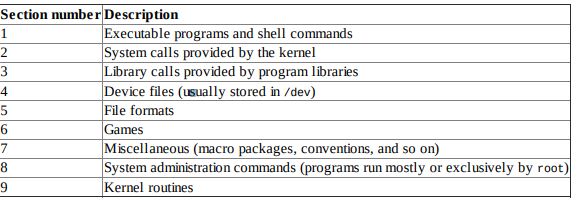

# Exploring Linux Command-Line Tools

## Internal Commands

Commands built into the shell. Consult your shell's `man` page for details.

#### Common

* Change the working dir: `cd <dir>`, `~` stands for home diretory.
* Create a directory: `mkdir <name>`
* Create a new empty file/s: `touch <name> <2_name> ...`
* Display the working dir: `pwd`
* Display text: `echo <text>`
* Execute a program `exec` (new process replaces the shell)
* Time an operation: `time <command>`
* Set options: `set`
* Terminate shell: `exit` and `logout` only for login shells.
* List files and directories: `ls`
*  

## Running programs

When you type a command that's not recognized by the shell as one of its internal commands, the shel checks it _path_ to find a program by that name to xecute it.

It's defined by the `PATH` environment variable.

You can run programs that aren't on the path by proding a complete path on the command line.

## Shell Command Tricks

* Command completion (`Tab`)
* History (Arrow keys, `Ctrl+P`, `Ctrl+N`)
    * Typing `history` alone displays all thec ommands int he histoy, and can execute a command by number, as in `!210` to execute command 210.
    * `history -c` cleans history
    * Bash history is stored in the `.bash_history` file in your `~` directory.
* Backward (reverse) search (`Ctrl+R`)
* Forward search (`Ctrl+S`)
* Finish search (`Ctrl+G`)
* Edit command in line
    * Move Within Line (start `Ctrl+A` or end `Ctrl+E`, or `Ctrl+arrow`)
    * Delete text (`Del` `Backspace` `Ctrl+K` `Ctrl+X+Backspace`)
    * Transpose text (`Ctrl+T`)
    * Change Case (`Esc + U` `Esc + L` `Esc + C`)
    * Invoke an Editor (`Ctrl+X + Ctrl+E`), attems to launch editor defined by the `#FCEDIT` or `$EDITOR` environment variable, or Emacs as a last resort.

## Shell Configuration

Shell hold configuraiton options in a plain-text format. The _bash_ configuraton files are actually _bash_ shell scripts. For now you should know that the `~/.bashrc` and `~/.profile` files are the main user configuration files for bash, and `/etc/bash.bashrc` and `/etc/profile` are the main globan configuration files.

For instance you can add directories to the `$PATH` environment variable.

## Environment Variables

You can set them in bash:

```
NNTPSERVER=demo.com
export NNTPSERVER

export NNTPSERER=demo.com
```

Thereafter, programs that need this information can refer to the environment varible.

```
echo $NNTPSERVER
> demo.com
```

You can also view the entire enviornment by typing `env`.

## Getting Help `man`

Linux provides a text-based help system known as `man` (short for manual), and its entries (known as man pages) provide succinct summaries of what a command, file or other feature does. For instance, to learn about man itself, you can type `man man`.

Press `spacebar` to move forwared a page, `Esc+V` to move back a page.



## Using Streams, Redirections, and pipes